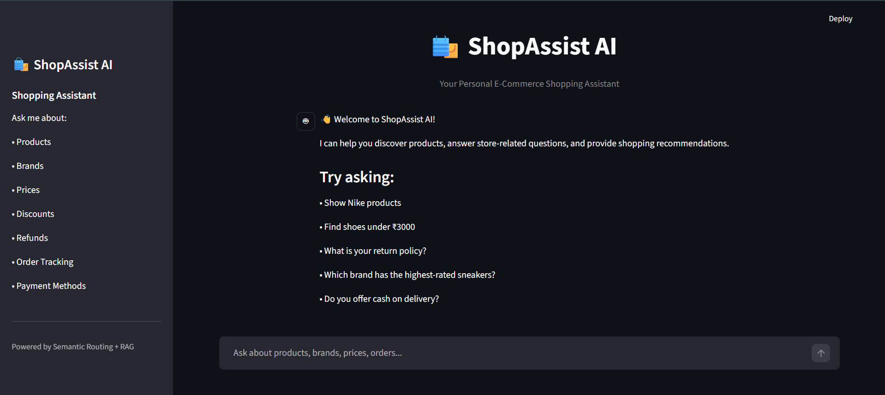

# 🛍️ ShopAssist AI

ShopAssist AI is an AI-powered e-commerce chatbot built using **Llama 3.3**, **GROQ**, **Semantic Routing**, **RAG**, and **SQL-based retrieval**.

The chatbot intelligently identifies user intent and routes queries to the appropriate processing pipeline, enabling accurate responses for both product-related searches and store-related FAQs.

It provides real-time product information from the e-commerce database while answering platform-related questions using a Retrieval-Augmented Generation (RAG) system.

---

## 🚀 Features

- Intent-based query routing using Semantic Routing
- FAQ Question Answering using RAG
- Real-time product retrieval using SQL queries
- Natural language shopping experience
- Streamlit-based chat interface
- Fast inference powered by GROQ and Llama 3.3

---

## 🎯 Supported Intents

### FAQ

Triggered when users ask questions related to platform policies or general information.

**Examples**
- What is your return policy?
- Do you offer cash on delivery?
- Is online payment available?
- How can I track my order?

### SQL

Activated when users request product listings or product information from the database.

**Examples**
- Show Nike products
- Find shoes under ₹3000
- Show Adidas sneakers below ₹5000
- Which brand has the highest-rated sneakers?

---

## 📸 Application Preview



---

## 🏗️ Architecture


---

## ⚙️ Set-up & Execution

### 1. Install Dependencies

```bash
pip install -r app/requirements.txt
```

### 2. Configure Environment Variables

Create a `.env` file inside the `app` directory:

```env
GROQ_MODEL=llama-3.3-70b-versatile
GROQ_API_KEY=your_groq_api_key
```

### 3. Run the Application

```bash
streamlit run app/main.py
```

---

## 🛠️ Tech Stack

- Python
- Streamlit
- GROQ
- Llama 3.3
- Semantic Routing
- RAG (Retrieval-Augmented Generation)
- SQL Database
- ChromaDB

---

## 📌 Note

This project demonstrates how Semantic Routing, RAG, and SQL retrieval can be combined to build an intelligent e-commerce shopping assistant capable of handling both informational and product-search queries.
